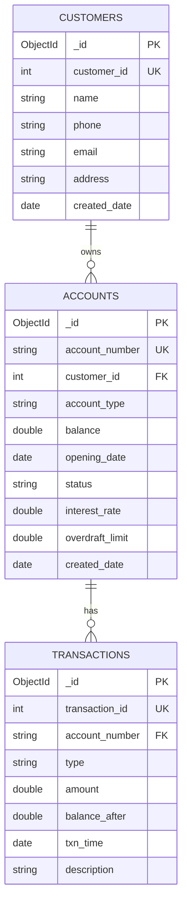
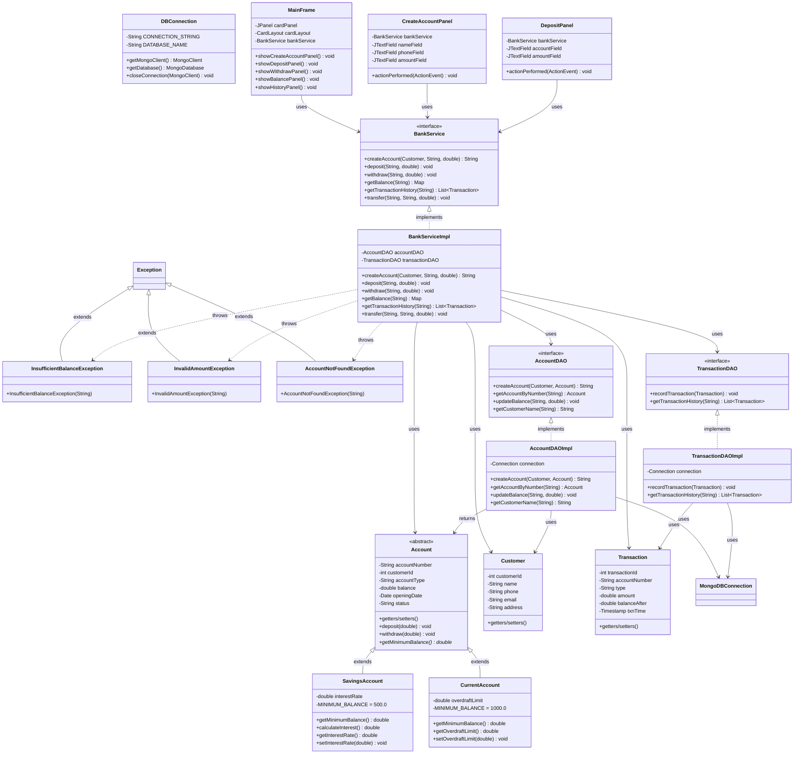
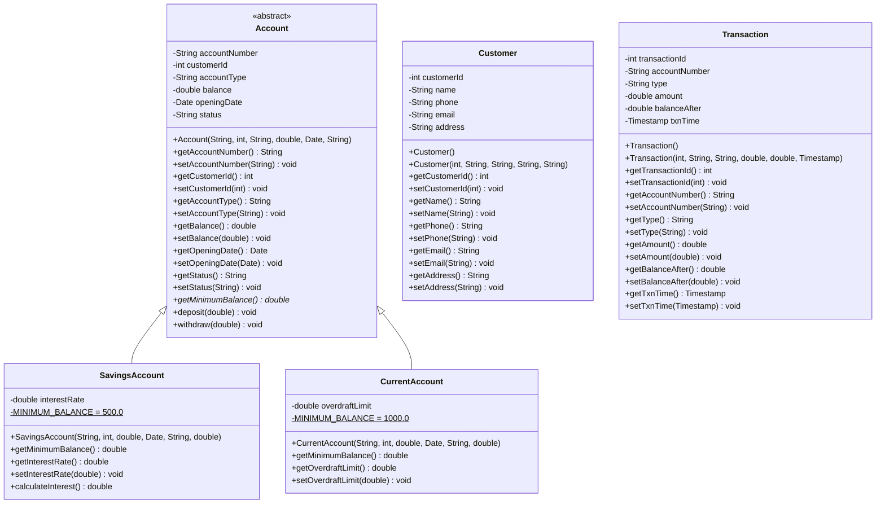
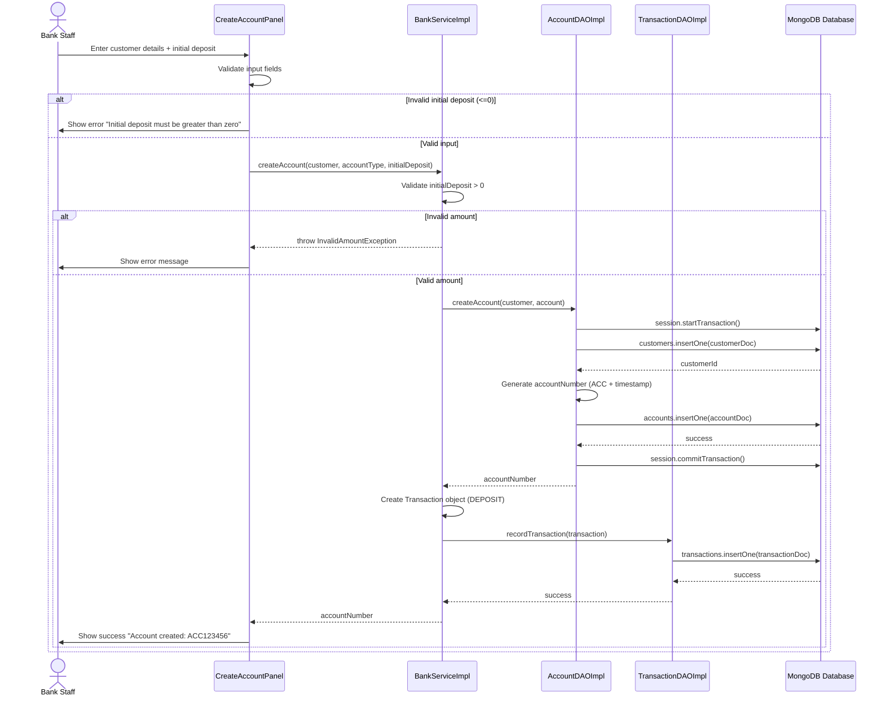
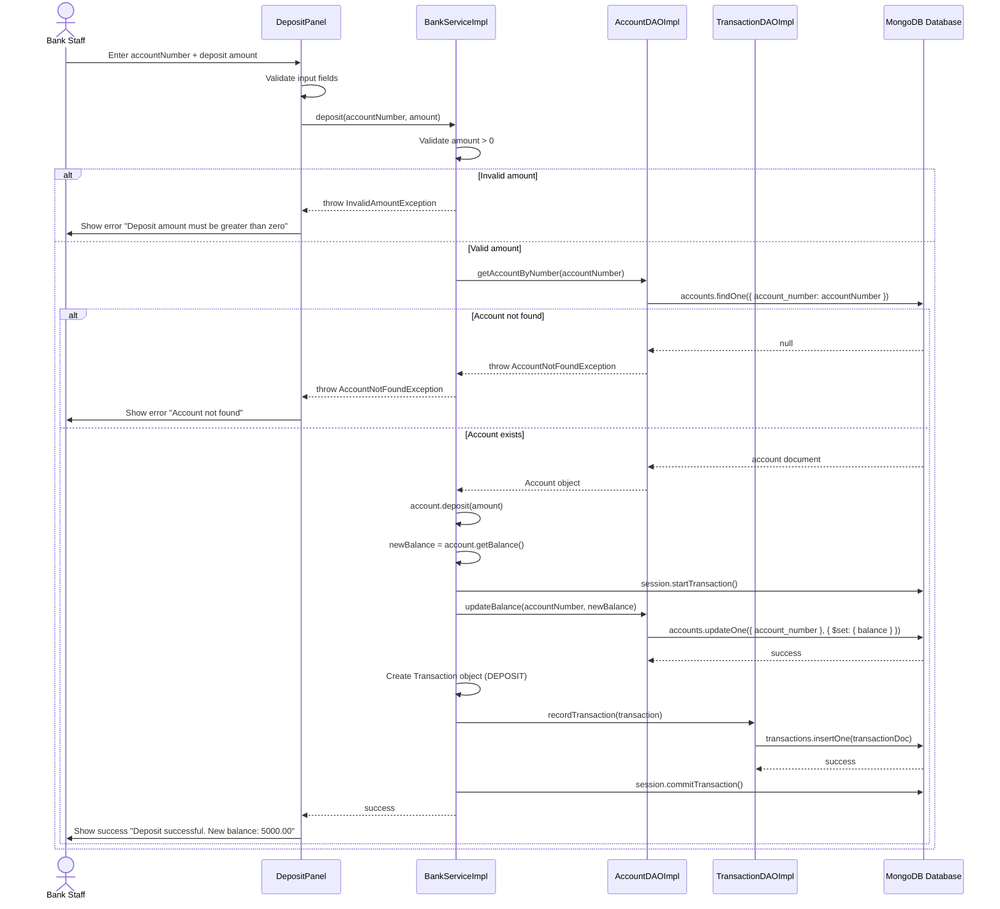
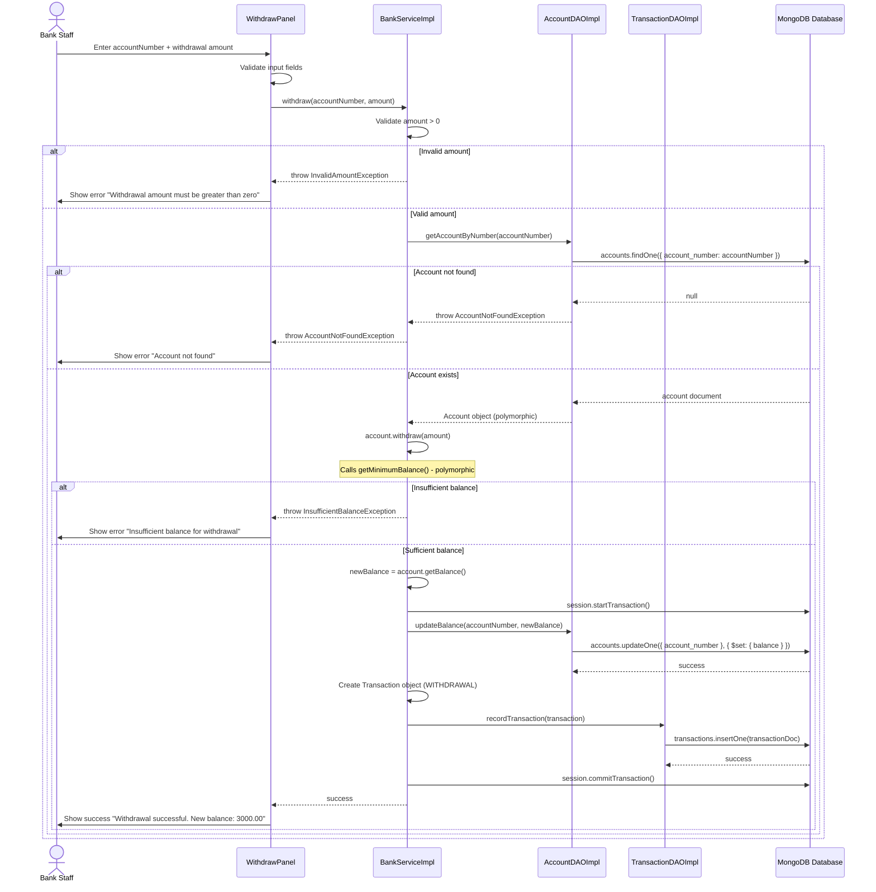
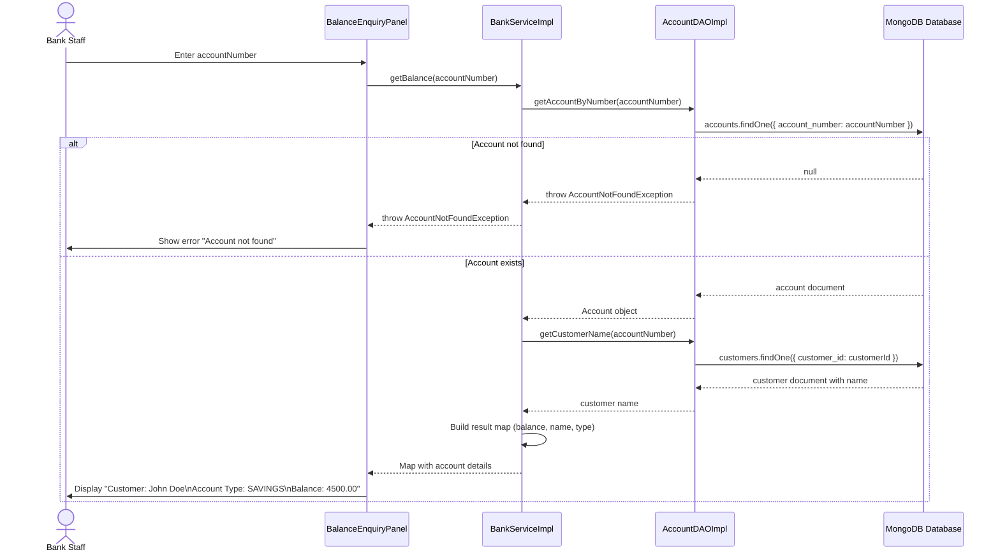
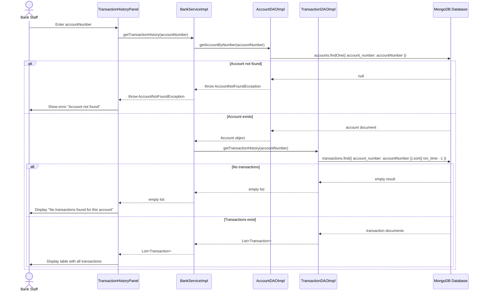
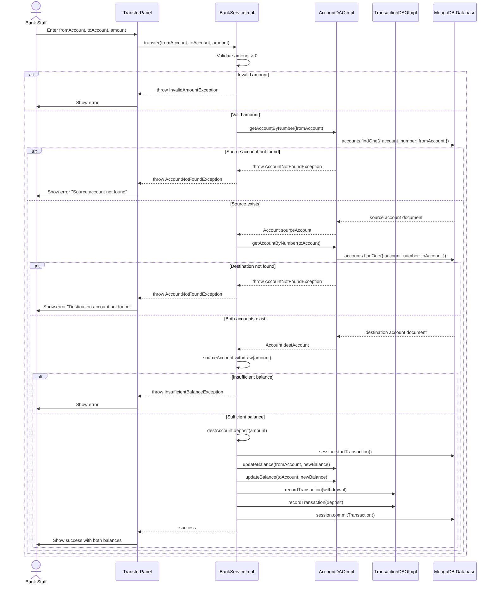

# Design Document: Online Banking System

## Overview

The Online Banking System is a Java desktop application designed for 4-hour hackathon implementation. The system enables bank staff to perform core banking operations: account creation, deposits, withdrawals, balance enquiries, and transaction history viewing. The architecture follows a layered design pattern with clear separation of concerns across model, data access, service, and presentation layers.

### Design Goals

1. **Demonstrate OOP Principles**: Explicit implementation of encapsulation, inheritance, polymorphism, and interface-based design to meet rubric requirements
2. **Maintainable Architecture**: Clean separation between UI, business logic, and data persistence layers
3. **Exception-Driven Error Handling**: Custom exceptions that flow through architectural layers with clear messaging
4. **Database Persistence**: MongoDB Java Driver-based persistence with proper transaction management
5. **Hackathon-Ready**: Straightforward implementation suitable for 4-hour timeframe with clear demonstration points

### Technology Stack

- **Language**: Java SE 8+
- **GUI Framework**: Java Swing
- **Database**: MongoDB 4.4+
- **Data Access**: MongoDB Java Driver
- **Build Tool**: Standard javac compilation

### Target Grading Rubric

- **3 marks**: Coding practices (naming, indentation, comments, modularity, readability)
- **3 marks**: Correct/appropriate use of OOP concepts
- **4 marks**: Functional correctness + individual presentation

## Architecture

### Layered Architecture

```
┌─────────────────────────────────────────────────────────┐
│                    UI Layer (Swing)                      │
│  MainFrame, CreateAccountPanel, DepositPanel,           │
│  WithdrawPanel, BalanceEnquiryPanel,                    │
│  TransactionHistoryPanel                                 │
└────────────────────┬────────────────────────────────────┘
                     │
                     ▼
┌─────────────────────────────────────────────────────────┐
│                  Service Layer                           │
│  BankService (interface) + BankServiceImpl               │
│  - Business logic and validation                         │
│  - Exception handling and propagation                    │
└────────────────────┬────────────────────────────────────┘
                     │
                     ▼
┌─────────────────────────────────────────────────────────┐
│                   DAO Layer                              │
│  AccountDAO (interface) + AccountDAOImpl                 │
│  TransactionDAO (interface) + TransactionDAOImpl         │
│  MongoDBConnection (utility)                             │
└────────────────────┬────────────────────────────────────┘
                     │
                     ▼
┌─────────────────────────────────────────────────────────┐
│                  MongoDB Database                        │
│  customers, accounts, transactions collections           │
└─────────────────────────────────────────────────────────┘

         ┌────────────────────────────────┐
         │      Model Layer (Entities)     │
         │  Customer, Account (abstract),  │
         │  SavingsAccount, CurrentAccount,│
         │  Transaction                    │
         └────────────────────────────────┘

         ┌────────────────────────────────┐
         │    Exception Layer              │
         │  InsufficientBalanceException,  │
         │  InvalidAmountException,        │
         │  AccountNotFoundException       │
         └────────────────────────────────┘
```

### Package Structure

```
com.banking
├── Main.java                          # Application entry point
├── model
│   ├── Customer.java                  # Customer entity
│   ├── Account.java                   # Abstract base class
│   ├── SavingsAccount.java           # Concrete account type
│   ├── CurrentAccount.java           # Concrete account type
│   └── Transaction.java              # Transaction entity
├── exception
│   ├── InsufficientBalanceException.java
│   ├── InvalidAmountException.java
│   └── AccountNotFoundException.java
├── dao
│   ├── AccountDAO.java               # Interface
│   ├── AccountDAOImpl.java           # Implementation
│   ├── TransactionDAO.java           # Interface
│   ├── TransactionDAOImpl.java       # Implementation
│   └── MongoDBConnection.java        # Connection utility
├── service
│   ├── BankService.java              # Interface
│   └── BankServiceImpl.java          # Implementation
└── ui
    ├── MainFrame.java                # Main window with navigation
    ├── CreateAccountPanel.java       # Account creation UI
    ├── DepositPanel.java            # Deposit UI
    ├── WithdrawPanel.java           # Withdrawal UI
    ├── BalanceEnquiryPanel.java     # Balance check UI
    └── TransactionHistoryPanel.java # Transaction history UI
```

## Components and Interfaces

### Model Layer

#### Account (Abstract Base Class)

```java
package com.banking.model;

public abstract class Account {
    private String accountNumber;
    private int customerId;
    private String accountType;
    private double balance;
    private Date openingDate;
    private String status;
    
    // Constructor
    public Account(String accountNumber, int customerId, String accountType, 
                   double balance, Date openingDate, String status) {
        this.accountNumber = accountNumber;
        this.customerId = customerId;
        this.accountType = accountType;
        this.balance = balance;
        this.openingDate = openingDate;
        this.status = status;
    }
    
    // Getters and Setters (encapsulation)
    public String getAccountNumber() { return accountNumber; }
    public void setAccountNumber(String accountNumber) { 
        this.accountNumber = accountNumber; 
    }
    
    public int getCustomerId() { return customerId; }
    public void setCustomerId(int customerId) { 
        this.customerId = customerId; 
    }
    
    public String getAccountType() { return accountType; }
    public void setAccountType(String accountType) { 
        this.accountType = accountType; 
    }
    
    public double getBalance() { return balance; }
    public void setBalance(double balance) { 
        this.balance = balance; 
    }
    
    public Date getOpeningDate() { return openingDate; }
    public void setOpeningDate(Date openingDate) { 
        this.openingDate = openingDate; 
    }
    
    public String getStatus() { return status; }
    public void setStatus(String status) { 
        this.status = status; 
    }
    
    // Abstract method for polymorphism demonstration
    public abstract double getMinimumBalance();
    
    // Common business logic
    public void deposit(double amount) throws InvalidAmountException {
        if (amount <= 0) {
            throw new InvalidAmountException("Deposit amount must be greater than zero");
        }
        this.balance += amount;
    }
    
    public void withdraw(double amount) throws InvalidAmountException, 
                                               InsufficientBalanceException {
        if (amount <= 0) {
            throw new InvalidAmountException("Withdrawal amount must be greater than zero");
        }
        if (this.balance - amount < getMinimumBalance()) {
            throw new InsufficientBalanceException("Insufficient balance for withdrawal");
        }
        this.balance -= amount;
    }
}
```

#### SavingsAccount (Concrete Subclass)

```java
package com.banking.model;

public class SavingsAccount extends Account {
    private static final double MINIMUM_BALANCE = 500.0;
    private double interestRate;
    
    public SavingsAccount(String accountNumber, int customerId, double balance, 
                         Date openingDate, String status, double interestRate) {
        super(accountNumber, customerId, "SAVINGS", balance, openingDate, status);
        this.interestRate = interestRate;
    }
    
    @Override
    public double getMinimumBalance() {
        return MINIMUM_BALANCE;
    }
    
    public double getInterestRate() {
        return interestRate;
    }
    
    public void setInterestRate(double interestRate) {
        this.interestRate = interestRate;
    }
    
    // Phase 2: Interest calculation (polymorphic behavior)
    public double calculateInterest() {
        return getBalance() * interestRate / 100;
    }
}
```

#### CurrentAccount (Concrete Subclass)

```java
package com.banking.model;

public class CurrentAccount extends Account {
    private static final double MINIMUM_BALANCE = 1000.0;
    private double overdraftLimit;
    
    public CurrentAccount(String accountNumber, int customerId, double balance, 
                         Date openingDate, String status, double overdraftLimit) {
        super(accountNumber, customerId, "CURRENT", balance, openingDate, status);
        this.overdraftLimit = overdraftLimit;
    }
    
    @Override
    public double getMinimumBalance() {
        return MINIMUM_BALANCE;
    }
    
    public double getOverdraftLimit() {
        return overdraftLimit;
    }
    
    public void setOverdraftLimit(double overdraftLimit) {
        this.overdraftLimit = overdraftLimit;
    }
}
```

#### Customer Entity

```java
package com.banking.model;

public class Customer {
    private int customerId;
    private String name;
    private String phone;
    private String email;
    private String address;
    
    // Constructors
    public Customer() {}
    
    public Customer(int customerId, String name, String phone, 
                   String email, String address) {
        this.customerId = customerId;
        this.name = name;
        this.phone = phone;
        this.email = email;
        this.address = address;
    }
    
    // Getters and Setters (encapsulation)
    public int getCustomerId() { return customerId; }
    public void setCustomerId(int customerId) { this.customerId = customerId; }
    
    public String getName() { return name; }
    public void setName(String name) { this.name = name; }
    
    public String getPhone() { return phone; }
    public void setPhone(String phone) { this.phone = phone; }
    
    public String getEmail() { return email; }
    public void setEmail(String email) { this.email = email; }
    
    public String getAddress() { return address; }
    public void setAddress(String address) { this.address = address; }
}
```

#### Transaction Entity

```java
package com.banking.model;

public class Transaction {
    private int transactionId;
    private String accountNumber;
    private String type;  // DEPOSIT, WITHDRAWAL, INTEREST
    private double amount;
    private double balanceAfter;
    private Timestamp txnTime;
    
    // Constructors
    public Transaction() {}
    
    public Transaction(int transactionId, String accountNumber, String type,
                      double amount, double balanceAfter, Timestamp txnTime) {
        this.transactionId = transactionId;
        this.accountNumber = accountNumber;
        this.type = type;
        this.amount = amount;
        this.balanceAfter = balanceAfter;
        this.txnTime = txnTime;
    }
    
    // Getters and Setters (encapsulation)
    public int getTransactionId() { return transactionId; }
    public void setTransactionId(int transactionId) { 
        this.transactionId = transactionId; 
    }
    
    public String getAccountNumber() { return accountNumber; }
    public void setAccountNumber(String accountNumber) { 
        this.accountNumber = accountNumber; 
    }
    
    public String getType() { return type; }
    public void setType(String type) { this.type = type; }
    
    public double getAmount() { return amount; }
    public void setAmount(double amount) { this.amount = amount; }
    
    public double getBalanceAfter() { return balanceAfter; }
    public void setBalanceAfter(double balanceAfter) { 
        this.balanceAfter = balanceAfter; 
    }
    
    public Timestamp getTxnTime() { return txnTime; }
    public void setTxnTime(Timestamp txnTime) { this.txnTime = txnTime; }
}
```

### Exception Layer

#### Custom Exceptions

```java
package com.banking.exception;

public class InsufficientBalanceException extends Exception {
    public InsufficientBalanceException(String message) {
        super(message);
    }
}

public class InvalidAmountException extends Exception {
    public InvalidAmountException(String message) {
        super(message);
    }
}

public class AccountNotFoundException extends Exception {
    public AccountNotFoundException(String message) {
        super(message);
    }
}
```

### DAO Layer

#### AccountDAO Interface

```java
package com.banking.dao;

public interface AccountDAO {
    /**
     * Creates a new customer and account with initial deposit
     * @return Generated account number
     */
    String createAccount(Customer customer, Account account) throws MongoException;
    
    /**
     * Retrieves account by account number
     */
    Account getAccountByNumber(String accountNumber) 
        throws MongoException, AccountNotFoundException;
    
    /**
     * Updates account balance
     */
    void updateBalance(String accountNumber, double newBalance) throws MongoException;
    
    /**
     * Retrieves customer name by account number
     */
    String getCustomerName(String accountNumber) throws MongoException;
}
```

#### TransactionDAO Interface

```java
package com.banking.dao;

public interface TransactionDAO {
    /**
     * Records a new transaction
     */
    void recordTransaction(Transaction transaction) throws MongoException;
    
    /**
     * Retrieves all transactions for an account
     */
    List<Transaction> getTransactionHistory(String accountNumber) throws MongoException;
}
```

### Service Layer

#### BankService Interface

```java
package com.banking.service;

public interface BankService {
    /**
     * Creates new customer account with initial deposit
     * @return Generated account number
     */
    String createAccount(Customer customer, String accountType, double initialDeposit) 
        throws InvalidAmountException, MongoException;
    
    /**
     * Deposits money into account
     */
    void deposit(String accountNumber, double amount) 
        throws AccountNotFoundException, InvalidAmountException, MongoException;
    
    /**
     * Withdraws money from account
     */
    void withdraw(String accountNumber, double amount) 
        throws AccountNotFoundException, InvalidAmountException, 
               InsufficientBalanceException, MongoException;
    
    /**
     * Retrieves account balance with customer details
     */
    Map<String, Object> getBalance(String accountNumber) 
        throws AccountNotFoundException, MongoException;
    
    /**
     * Retrieves transaction history
     */
    List<Transaction> getTransactionHistory(String accountNumber) 
        throws AccountNotFoundException, MongoException;
    
    // Phase 2 methods
    void transfer(String fromAccount, String toAccount, double amount) 
        throws AccountNotFoundException, InvalidAmountException, 
               InsufficientBalanceException, MongoException;
}
```

## Data Models

### Database Schema

#### customers Collection

```json
{
  "_id": ObjectId("..."),
  "customer_id": 1,
  "name": "John Doe",
  "phone": "1234567890",
  "email": "john@example.com",
  "address": "123 Main St",
  "created_date": ISODate("2024-01-01T00:00:00Z")
}
```

**Indexes:**
```javascript
db.customers.createIndex({ "customer_id": 1 }, { unique: true })
```

**Fields:**
- `_id` (ObjectId): MongoDB auto-generated unique identifier
- `customer_id` (Int32): Unique customer identifier (auto-increment pattern)
- `name` (String, required): Customer full name
- `phone` (String, required): Contact phone number
- `email` (String): Email address
- `address` (String): Physical address
- `created_date` (Date): Record creation timestamp

#### accounts Collection

```json
{
  "_id": ObjectId("..."),
  "account_number": "ACC1234567890123",
  "customer_id": 1,
  "account_type": "SAVINGS",
  "balance": 5000.00,
  "opening_date": ISODate("2024-01-01T00:00:00Z"),
  "status": "ACTIVE",
  "interest_rate": 3.50,
  "overdraft_limit": 0.00,
  "created_date": ISODate("2024-01-01T00:00:00Z")
}
```

**Indexes:**
```javascript
db.accounts.createIndex({ "account_number": 1 }, { unique: true })
db.accounts.createIndex({ "customer_id": 1 })
db.accounts.createIndex({ "status": 1 })
```

**Fields:**
- `_id` (ObjectId): MongoDB auto-generated unique identifier
- `account_number` (String, required, unique): Unique account identifier (format: ACC + timestamp + random)
- `customer_id` (Int32, required): References customer document
- `account_type` (String, required): "SAVINGS" or "CURRENT"
- `balance` (Double, required): Current account balance
- `opening_date` (Date, required): Account opening date
- `status` (String): "ACTIVE", "CLOSED", or "FROZEN"
- `interest_rate` (Double): Interest rate for savings accounts (Phase 2)
- `overdraft_limit` (Double): Overdraft limit for current accounts
- `created_date` (Date): Record creation timestamp

**Validation Rules:**
```javascript
db.createCollection("accounts", {
  validator: {
    $jsonSchema: {
      bsonType: "object",
      required: ["account_number", "customer_id", "account_type", "balance", "opening_date"],
      properties: {
        account_number: { bsonType: "string" },
        customer_id: { bsonType: "int" },
        account_type: { enum: ["SAVINGS", "CURRENT"] },
        balance: { bsonType: "double", minimum: 0 },
        opening_date: { bsonType: "date" },
        status: { enum: ["ACTIVE", "CLOSED", "FROZEN"] }
      }
    }
  }
})
```

#### transactions Collection

```json
{
  "_id": ObjectId("..."),
  "transaction_id": 1,
  "account_number": "ACC1234567890123",
  "type": "DEPOSIT",
  "amount": 1000.00,
  "balance_after": 5000.00,
  "txn_time": ISODate("2024-01-01T12:30:00Z"),
  "description": "Initial deposit"
}
```

**Indexes:**
```javascript
db.transactions.createIndex({ "transaction_id": 1 }, { unique: true })
db.transactions.createIndex({ "account_number": 1 })
db.transactions.createIndex({ "txn_time": -1 })
```

**Fields:**
- `_id` (ObjectId): MongoDB auto-generated unique identifier
- `transaction_id` (Int32): Unique transaction identifier (auto-increment pattern)
- `account_number` (String, required): References account document
- `type` (String, required): "DEPOSIT", "WITHDRAWAL", or "INTEREST"
- `amount` (Double, required): Transaction amount
- `balance_after` (Double, required): Balance after transaction
- `txn_time` (Date): Transaction timestamp
- `description` (String): Optional transaction description

**Validation Rules:**
```javascript
db.createCollection("transactions", {
  validator: {
    $jsonSchema: {
      bsonType: "object",
      required: ["transaction_id", "account_number", "type", "amount", "balance_after"],
      properties: {
        transaction_id: { bsonType: "int" },
        account_number: { bsonType: "string" },
        type: { enum: ["DEPOSIT", "WITHDRAWAL", "INTEREST"] },
        amount: { bsonType: "double" },
        balance_after: { bsonType: "double" },
        txn_time: { bsonType: "date" }
      }
    }
  }
})
```

### Entity Relationship Diagram



### Class Diagram



### Refined Class Diagram with All Attributes and Methods



## Sequence Flows

### 1. Create Account Sequence




### 2. Deposit Money Sequence



### 3. Withdraw Money Sequence



### 4. Balance Enquiry Sequence



### 5. Transaction History Sequence



### 6. Transfer Funds Sequence (Phase 2)



## Error Handling

### Exception Flow Through Layers

```
┌──────────────────────────────────────────────────────────┐
│                     UI Layer                             │
│  - Catches all checked exceptions                        │
│  - Displays user-friendly error messages                 │
│  - Shows JOptionPane error dialogs                       │
└────────────────────┬─────────────────────────────────────┘
                     │ throws exceptions
                     ▼
┌──────────────────────────────────────────────────────────┐
│                   Service Layer                          │
│  - Throws custom business exceptions                     │
│  - Validates business rules                              │
│  - Wraps/translates DAO layer exceptions                 │
└────────────────────┬─────────────────────────────────────┘
                     │ throws exceptions
                     ▼
┌──────────────────────────────────────────────────────────┐
│                    DAO Layer                             │
│  - Throws AccountNotFoundException                       │
│  - Propagates MongoException                             │
│  - Handles database connection errors                    │
└──────────────────────────────────────────────────────────┘
```

### Custom Exception Mapping

| Exception | Thrown By | Caught By | User Message |
|-----------|-----------|-----------|--------------|
| `InvalidAmountException` | Service layer (validation) | UI layer | "Deposit amount must be greater than zero" |
| `InsufficientBalanceException` | Service layer (Account.withdraw) | UI layer | "Insufficient balance for withdrawal" |
| `AccountNotFoundException` | DAO layer (query returns empty) | UI layer | "Account not found" |
| `SQLException` | DAO layer (database errors) | UI layer | "Database error occurred. Please try again" |

### Exception Handling Pattern

```java
// UI Layer Example (DepositPanel)
private void handleDeposit() {
    try {
        String accountNumber = accountField.getText().trim();
        double amount = Double.parseDouble(amountField.getText().trim());
        
        bankService.deposit(accountNumber, amount);
        JOptionPane.showMessageDialog(this, 
            "Deposit successful!", 
            "Success", 
            JOptionPane.INFORMATION_MESSAGE);
            
    } catch (InvalidAmountException e) {
        JOptionPane.showMessageDialog(this, 
            e.getMessage(), 
            "Invalid Amount", 
            JOptionPane.ERROR_MESSAGE);
            
    } catch (AccountNotFoundException e) {
        JOptionPane.showMessageDialog(this, 
            e.getMessage(), 
            "Account Not Found", 
            JOptionPane.ERROR_MESSAGE);
            
    } catch (SQLException e) {
        JOptionPane.showMessageDialog(this, 
            "Database error: " + e.getMessage(), 
            "Error", 
            JOptionPane.ERROR_MESSAGE);
            
    } catch (NumberFormatException e) {
        JOptionPane.showMessageDialog(this, 
            "Please enter a valid number", 
            "Input Error", 
            JOptionPane.ERROR_MESSAGE);
    }
}
```

```java
// Service Layer Example (BankServiceImpl)
@Override
public void deposit(String accountNumber, double amount) 
        throws AccountNotFoundException, InvalidAmountException, SQLException {
    
    // Validation
    if (amount <= 0) {
        throw new InvalidAmountException("Deposit amount must be greater than zero");
    }
    
    // Get account (may throw AccountNotFoundException)
    Account account = accountDAO.getAccountByNumber(accountNumber);
    
    // Business logic
    account.deposit(amount);  // Updates balance in memory
    
    // Persist changes
    try {
        connection.setAutoCommit(false);  // Begin transaction
        
        accountDAO.updateBalance(accountNumber, account.getBalance());
        
        Transaction txn = new Transaction();
        txn.setAccountNumber(accountNumber);
        txn.setType("DEPOSIT");
        txn.setAmount(amount);
        txn.setBalanceAfter(account.getBalance());
        transactionDAO.recordTransaction(txn);
        
        connection.commit();
    } catch (SQLException e) {
        connection.rollback();
        throw e;
    } finally {
        connection.setAutoCommit(true);
    }
}
```

### Error Handling Strategy

1. **Input Validation**: UI layer validates basic input (non-empty, numeric format)
2. **Business Validation**: Service layer validates business rules (amount > 0, sufficient balance)
3. **Data Validation**: DAO layer validates data existence (account exists)
4. **Exception Translation**: Each layer catches lower-level exceptions and either handles or wraps them
5. **User Communication**: UI layer translates all exceptions into user-friendly messages
6. **Transaction Management**: Service layer manages database transactions, rolling back on errors


## OOP Concepts Demonstrated

### CRITICAL: Rubric Mapping Table for Live Demo

This table explicitly maps each OOP concept to the exact classes and code locations where they're implemented. **Use this during the individual presentation to quickly demonstrate OOP understanding.**

| OOP Concept | Implementation Location | Specific Example | Demo Talking Points |
|-------------|------------------------|------------------|---------------------|
| **Encapsulation** | All model classes: `Account`, `Customer`, `Transaction`, `SavingsAccount`, `CurrentAccount` | Private fields with public getters/setters in `Account` class:<br>```java<br>private double balance;<br>public double getBalance() { return balance; }<br>public void setBalance(double balance) { this.balance = balance; }<br>``` | "All class attributes are private with controlled access through public getters and setters. For example, the Account class encapsulates balance - it cannot be directly modified from outside, ensuring data integrity." |
| **Inheritance** | `Account` (abstract base class) extended by `SavingsAccount` and `CurrentAccount` | Abstract base class:<br>```java<br>public abstract class Account {<br>    // Common attributes and methods<br>    public abstract double getMinimumBalance();<br>}<br><br>public class SavingsAccount extends Account {<br>    public double getMinimumBalance() {<br>        return 500.0;<br>    }<br>}<br>``` | "Account is an abstract base class with common properties like accountNumber and balance. SavingsAccount and CurrentAccount inherit from Account and provide their own implementations. This promotes code reuse." |
| **Polymorphism** | `Account` type used throughout service layer; runtime behavior differs based on actual type | In `BankServiceImpl.withdraw()`:<br>```java<br>Account account = accountDAO.getAccountByNumber(accountNumber);<br>// Calls getMinimumBalance() - actual method depends on runtime type<br>account.withdraw(amount); // Different behavior for Savings vs Current<br>``` | "When we call account.withdraw(), the minimum balance check behaves differently - SavingsAccount requires 500, CurrentAccount requires 1000. The same method call produces different behavior based on the actual object type at runtime." |
| **Interfaces** | `AccountDAO`, `TransactionDAO`, `BankService` interfaces with implementation classes | Interface definition:<br>```java<br>public interface BankService {<br>    void deposit(String accountNumber, double amount);<br>    void withdraw(String accountNumber, double amount);<br>}<br><br>public class BankServiceImpl implements BankService {<br>    // Implementation<br>}<br>``` | "We use interfaces to define contracts. BankService interface declares what operations are available, and BankServiceImpl provides the actual implementation. This allows us to change implementations without affecting UI code." |
| **Abstraction** | Abstract `Account` class with abstract method `getMinimumBalance()` | Abstract method:<br>```java<br>public abstract double getMinimumBalance();<br>``` | "The Account class defines an abstract method getMinimumBalance() without implementation. Each subclass must provide its own implementation based on account type rules." |
| **Custom Exceptions** | `InsufficientBalanceException`, `InvalidAmountException`, `AccountNotFoundException` | Exception definition and usage:<br>```java<br>public class InvalidAmountException extends Exception {<br>    public InvalidAmountException(String message) {<br>        super(message);<br>    }<br>}<br><br>// Usage<br>if (amount <= 0) {<br>    throw new InvalidAmountException("Amount must be positive");<br>}<br>``` | "We created custom checked exceptions for business rule violations. This provides clear, specific error handling that flows from service layer to UI layer with meaningful messages." |
| **Separation of Concerns** | Layered architecture: model, dao, service, ui packages | Package structure:<br>```<br>com.banking.model<br>com.banking.dao<br>com.banking.service<br>com.banking.ui<br>``` | "The application is organized into distinct layers. UI handles presentation, service contains business logic, DAO manages data access, and model defines entities. Each layer has a single responsibility." |
| **Dependency Injection** | Service layer receives DAO instances via constructor | Constructor injection:<br>```java<br>public class BankServiceImpl implements BankService {<br>    private AccountDAO accountDAO;<br>    private TransactionDAO transactionDAO;<br>    <br>    public BankServiceImpl(AccountDAO accountDAO, <br>                          TransactionDAO transactionDAO) {<br>        this.accountDAO = accountDAO;<br>        this.transactionDAO = transactionDAO;<br>    }<br>}<br>``` | "Rather than creating dependencies internally, we inject them through constructors. This makes the code more testable and loosely coupled." |

### Quick Demo Script for Presentation

**30-Second OOP Overview:**
1. "Let me show you the four core OOP concepts in my code."
2. **Encapsulation**: Open `Account.java` → point to private fields and public getters
3. **Inheritance**: Show `Account` abstract class → then `SavingsAccount extends Account`
4. **Polymorphism**: Show `BankServiceImpl.withdraw()` → explain `account.getMinimumBalance()` calls different implementations
5. **Interfaces**: Show `BankService` interface → `BankServiceImpl implements BankService`
6. "This demonstrates proper OOP design with reusable, maintainable code."

### Detailed OOP Implementation

#### 1. Encapsulation Implementation

**Definition**: Hiding internal state and requiring all interaction through methods.

**Implementation**:
- All fields in `Account`, `Customer`, `Transaction` are `private`
- Public getter/setter methods provide controlled access
- Business logic methods (`deposit`, `withdraw`) encapsulate validation

**Benefits**:
- Data integrity (balance cannot be arbitrarily modified)
- Validation enforcement (e.g., amount must be positive)
- Implementation can change without affecting clients

#### 2. Inheritance Implementation

**Definition**: Creating new classes from existing classes to promote code reuse.

**Implementation**:
- `Account` is abstract base class with common properties
- `SavingsAccount` and `CurrentAccount` extend `Account`
- Subclasses inherit all fields and methods from `Account`
- Subclasses override `getMinimumBalance()` with specific values

**Benefits**:
- Code reuse (balance, accountNumber defined once)
- Common interface for all account types
- Easy to add new account types (e.g., `StudentAccount`)

#### 3. Polymorphism Implementation

**Definition**: Same interface, different implementations based on object type.

**Implementation**:
- `Account` reference can point to `SavingsAccount` or `CurrentAccount`
- Method calls like `getMinimumBalance()` execute different code based on runtime type
- Service layer works with `Account` type without knowing specific subclass

**Example**:
```java
Account account = accountDAO.getAccountByNumber(accountNumber);
// If account is SavingsAccount, returns 500
// If account is CurrentAccount, returns 1000
double minBalance = account.getMinimumBalance();
```

**Benefits**:
- Flexible code that works with multiple types
- New account types can be added without changing service layer
- Reduces conditional logic (no if/else for account type)

#### 4. Interface-Based Design Implementation

**Definition**: Defining contracts through interfaces, separating specification from implementation.

**Implementation**:
- `AccountDAO` interface defines data access contract
- `AccountDAOImpl` provides MySQL implementation
- `BankService` interface defines business operations
- `BankServiceImpl` provides implementation
- UI layer depends on `BankService` interface, not implementation

**Benefits**:
- Can swap implementations (e.g., PostgreSQL DAO) without changing clients
- Easier testing (can create mock implementations)
- Clear contracts between layers

## Testing Strategy

### Testing Approach for 4-Hour Hackathon

Given the time constraint, testing will focus on **manual testing with structured test scenarios** rather than automated unit tests. The goal is functional correctness and successful demonstration.

### Testing Priorities

1. **MVP Features (Must Test)**:
   - Account creation with initial deposit
   - Deposit to existing account
   - Withdrawal from account with sufficient balance
   - Withdrawal attempt with insufficient balance (error case)
   - Balance enquiry
   - Transaction history viewing

2. **Error Scenarios (Critical for Robustness)**:
   - Invalid account numbers
   - Negative or zero amounts
   - Non-existent accounts
   - Database connection errors

3. **Phase 2 Features (If Time Permits)**:
   - Fund transfers
   - Interest calculation

### Manual Test Scenarios

#### Test Scenario 1: Create Account
| Step | Action | Expected Result | Pass/Fail |
|------|--------|----------------|-----------|
| 1 | Launch application | MainFrame displays with menu | |
| 2 | Navigate to Create Account | CreateAccountPanel displays | |
| 3 | Enter customer details: Name="John Doe", Phone="1234567890", Email="john@test.com", Address="123 Main St", AccountType="SAVINGS", Initial Deposit=1000 | Fields accept input | |
| 4 | Click "Create Account" button | Success message with account number displayed | |
| 5 | Verify database | Customer record in `customers` table, Account record in `accounts` table, Transaction record in `transactions` table | |

#### Test Scenario 2: Deposit Money
| Step | Action | Expected Result | Pass/Fail |
|------|--------|----------------|-----------|
| 1 | Navigate to Deposit panel | DepositPanel displays | |
| 2 | Enter valid account number from Test 1 | Field accepts input | |
| 3 | Enter amount = 500 | Field accepts input | |
| 4 | Click "Deposit" button | Success message "Deposit successful. New balance: 1500.00" | |
| 5 | Verify database | Account balance = 1500, new transaction record | |

#### Test Scenario 3: Withdraw Money (Sufficient Balance)
| Step | Action | Expected Result | Pass/Fail |
|------|--------|----------------|-----------|
| 1 | Navigate to Withdraw panel | WithdrawPanel displays | |
| 2 | Enter valid account number | Field accepts input | |
| 3 | Enter amount = 400 | Field accepts input | |
| 4 | Click "Withdraw" button | Success message "Withdrawal successful. New balance: 1100.00" | |
| 5 | Verify database | Account balance = 1100, new transaction record | |

#### Test Scenario 4: Withdraw Money (Insufficient Balance)
| Step | Action | Expected Result | Pass/Fail |
|------|--------|----------------|-----------|
| 1 | Navigate to Withdraw panel | WithdrawPanel displays | |
| 2 | Enter valid account number (balance = 1100, min = 500 for savings) | Field accepts input | |
| 3 | Enter amount = 700 | Would leave balance = 400 < 500 | |
| 4 | Click "Withdraw" button | Error message "Insufficient balance for withdrawal" | |
| 5 | Verify database | Account balance unchanged at 1100 | |

#### Test Scenario 5: Balance Enquiry
| Step | Action | Expected Result | Pass/Fail |
|------|--------|----------------|-----------|
| 1 | Navigate to Balance Enquiry panel | BalanceEnquiryPanel displays | |
| 2 | Enter valid account number | Field accepts input | |
| 3 | Click "Check Balance" button | Displays "Customer: John Doe\nAccount Type: SAVINGS\nBalance: 1100.00" | |

#### Test Scenario 6: Transaction History
| Step | Action | Expected Result | Pass/Fail |
|------|--------|----------------|-----------|
| 1 | Navigate to Transaction History panel | TransactionHistoryPanel displays | |
| 2 | Enter valid account number | Field accepts input | |
| 3 | Click "View History" button | Table displays 3 transactions (deposit 1000, deposit 500, withdrawal 400) in reverse chronological order | |

#### Test Scenario 7: Error Handling - Invalid Account
| Step | Action | Expected Result | Pass/Fail |
|------|--------|----------------|-----------|
| 1 | Navigate to Balance Enquiry panel | Panel displays | |
| 2 | Enter non-existent account number "ACC999999" | Field accepts input | |
| 3 | Click "Check Balance" button | Error message "Account not found" | |

#### Test Scenario 8: Error Handling - Invalid Amount
| Step | Action | Expected Result | Pass/Fail |
|------|--------|----------------|-----------|
| 1 | Navigate to Deposit panel | Panel displays | |
| 2 | Enter valid account number | Field accepts input | |
| 3 | Enter amount = -100 or 0 | Field accepts input | |
| 4 | Click "Deposit" button | Error message "Deposit amount must be greater than zero" | |

### Database Verification Queries

After each test, run these queries to verify data integrity:

```sql
-- Verify account creation
SELECT c.*, a.* 
FROM customers c 
JOIN accounts a ON c.customer_id = a.customer_id 
WHERE a.account_number = 'ACC123456';

-- Verify transaction records
SELECT * FROM transactions 
WHERE account_number = 'ACC123456' 
ORDER BY txn_time DESC;

-- Verify balance consistency
SELECT account_number, balance,
       (SELECT SUM(CASE WHEN type = 'DEPOSIT' THEN amount ELSE -amount END)
        FROM transactions t 
        WHERE t.account_number = a.account_number) as calculated_balance
FROM accounts a
WHERE account_number = 'ACC123456';
```

### Testing Checklist for Demo

Before presenting:

- [ ] Database connection successful
- [ ] All 5 MVP operations work correctly
- [ ] Error messages display properly for invalid inputs
- [ ] Transaction history shows correct chronological order
- [ ] Balance calculations are accurate (2 decimal places)
- [ ] GUI is responsive and user-friendly
- [ ] No runtime exceptions during normal operation
- [ ] Database tables contain expected data after operations
- [ ] Can demonstrate OOP concepts (show code for inheritance, polymorphism, interfaces)
- [ ] Code is well-commented and formatted

### Performance Considerations

For hackathon scope, performance is not a primary concern, but keep in mind:

- Database connections should be properly closed in finally blocks
- PreparedStatements should be used to prevent SQL injection
- Transaction history queries should be limited (e.g., last 100 transactions)
- GUI should remain responsive during database operations (consider showing loading indicators)

### Known Limitations (Acceptable for Hackathon)

1. No concurrent access handling (single-user application assumption)
2. No password/authentication for database connection (hardcoded)
3. No audit logging beyond transaction records
4. No data export functionality
5. Basic UI design (functional over aesthetic)
6. No input sanitization beyond basic validation

## Implementation Notes

### Account Number Generation Strategy

```java
public String generateAccountNumber() {
    return "ACC" + System.currentTimeMillis() + 
           (int)(Math.random() * 1000);
}
```

Format: `ACC` + timestamp + random 3-digit number
- Ensures uniqueness through timestamp
- Easy to identify as account number with "ACC" prefix
- Short enough to type manually during testing

### Database Connection Management

```java
public class DBConnection {
    private static final String URL = "jdbc:mysql://localhost:3306/banking_db";
    private static final String USER = "root";
    private static final String PASSWORD = "password";
    
    public static Connection getConnection() throws SQLException {
        return DriverManager.getConnection(URL, USER, PASSWORD);
    }
    
    public static void closeConnection(Connection conn) {
        if (conn != null) {
            try {
                conn.close();
            } catch (SQLException e) {
                e.printStackTrace();
            }
        }
    }
}
```

**For Hackathon**:
- Use hardcoded credentials (acceptable for demo)
- Create database schema during setup phase
- Test connection before starting GUI implementation

### Transaction Management Pattern

```java
Connection conn = null;
try {
    conn = DBConnection.getConnection();
    conn.setAutoCommit(false);
    
    // Multiple database operations
    accountDAO.updateBalance(accountNumber, newBalance);
    transactionDAO.recordTransaction(transaction);
    
    conn.commit();
} catch (SQLException e) {
    if (conn != null) {
        conn.rollback();
    }
    throw e;
} finally {
    if (conn != null) {
        conn.setAutoCommit(true);
    }
    DBConnection.closeConnection(conn);
}
```

### GUI Layout Recommendations

- Use `CardLayout` for switching between panels in MainFrame
- Use `GridBagLayout` or `GroupLayout` for form panels
- Display results in `JTextArea` (read-only) or `JTable` (for transaction history)
- Use `JOptionPane` for success/error messages
- Include clear labels for all input fields
- Add descriptive buttons ("Create Account", "Deposit", not just "Submit")

### Code Quality Checklist

**Naming Conventions**:
- Classes: PascalCase (`BankServiceImpl`, `AccountDAO`)
- Methods: camelCase (`createAccount`, `getBalance`)
- Variables: camelCase (`accountNumber`, `initialDeposit`)
- Constants: UPPER_SNAKE_CASE (`MINIMUM_BALANCE`)
- Packages: lowercase (`com.banking.model`)

**Comments**:
- Javadoc for all public methods
- Inline comments for complex business logic
- Class-level comments explaining purpose

**Formatting**:
- Consistent indentation (4 spaces or 1 tab)
- Braces on same line or next line (pick one style)
- Blank lines between methods
- Maximum line length ~100 characters

### Implementation Order for Hackathon

**Hour 1: Foundation**
1. Create database schema
2. Implement model classes (Customer, Account, SavingsAccount, CurrentAccount, Transaction)
3. Implement custom exceptions
4. Implement DBConnection utility

**Hour 2: Data Access**
1. Implement AccountDAO interface and AccountDAOImpl
2. Implement TransactionDAO interface and TransactionDAOImpl
3. Test DAOs with simple main method

**Hour 3: Business Logic & UI Framework**
1. Implement BankService interface and BankServiceImpl
2. Create MainFrame with CardLayout
3. Implement CreateAccountPanel
4. Test account creation end-to-end

**Hour 4: Complete UI & Testing**
1. Implement DepositPanel, WithdrawPanel
2. Implement BalanceEnquiryPanel, TransactionHistoryPanel
3. Test all MVP features
4. Fix bugs, polish UI
5. Prepare demo script

### Database Setup Script

```sql
-- Create database
CREATE DATABASE IF NOT EXISTS banking_db;
USE banking_db;

-- Create tables
CREATE TABLE customers (
    customer_id INT PRIMARY KEY AUTO_INCREMENT,
    name VARCHAR(100) NOT NULL,
    phone VARCHAR(15) NOT NULL,
    email VARCHAR(100),
    address VARCHAR(255),
    created_date TIMESTAMP DEFAULT CURRENT_TIMESTAMP
);

CREATE TABLE accounts (
    account_number VARCHAR(20) PRIMARY KEY,
    customer_id INT NOT NULL,
    account_type ENUM('SAVINGS', 'CURRENT') NOT NULL,
    balance DECIMAL(15, 2) NOT NULL DEFAULT 0.00,
    opening_date DATE NOT NULL,
    status ENUM('ACTIVE', 'CLOSED', 'FROZEN') DEFAULT 'ACTIVE',
    interest_rate DECIMAL(5, 2) DEFAULT 0.00,
    overdraft_limit DECIMAL(15, 2) DEFAULT 0.00,
    created_date TIMESTAMP DEFAULT CURRENT_TIMESTAMP,
    FOREIGN KEY (customer_id) REFERENCES customers(customer_id) ON DELETE CASCADE,
    INDEX idx_customer_id (customer_id),
    INDEX idx_status (status)
);

CREATE TABLE transactions (
    transaction_id INT PRIMARY KEY AUTO_INCREMENT,
    account_number VARCHAR(20) NOT NULL,
    type ENUM('DEPOSIT', 'WITHDRAWAL', 'INTEREST') NOT NULL,
    amount DECIMAL(15, 2) NOT NULL,
    balance_after DECIMAL(15, 2) NOT NULL,
    txn_time TIMESTAMP DEFAULT CURRENT_TIMESTAMP,
    description VARCHAR(255),
    FOREIGN KEY (account_number) REFERENCES accounts(account_number) ON DELETE CASCADE,
    INDEX idx_account_number (account_number),
    INDEX idx_txn_time (txn_time)
);
```

Run this script in MySQL before starting implementation.

