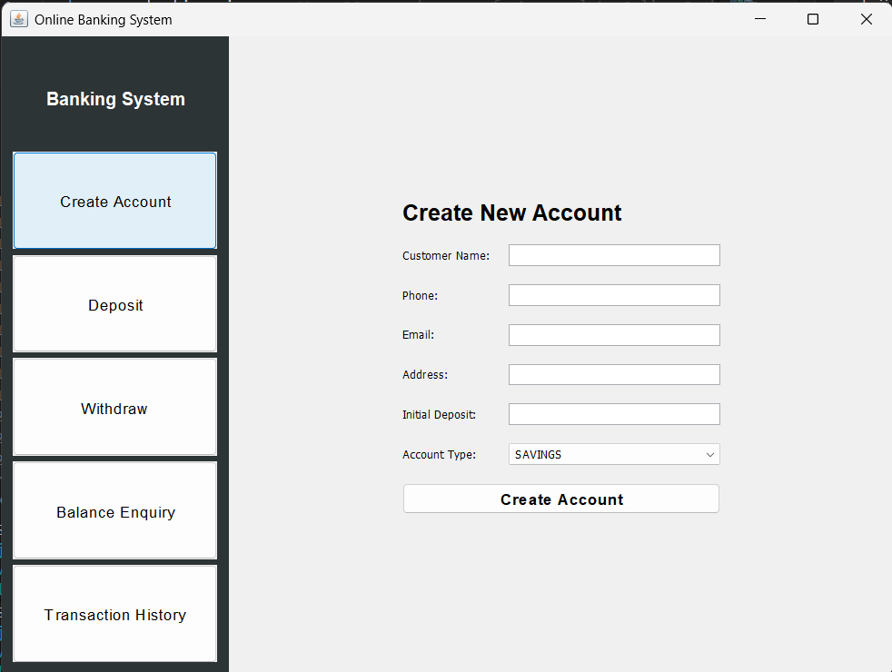
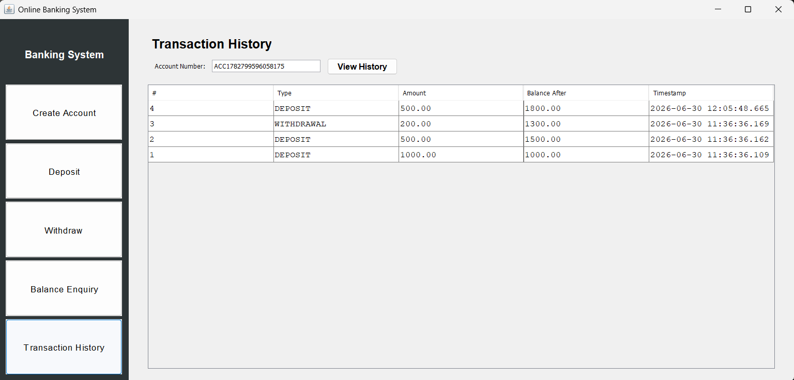
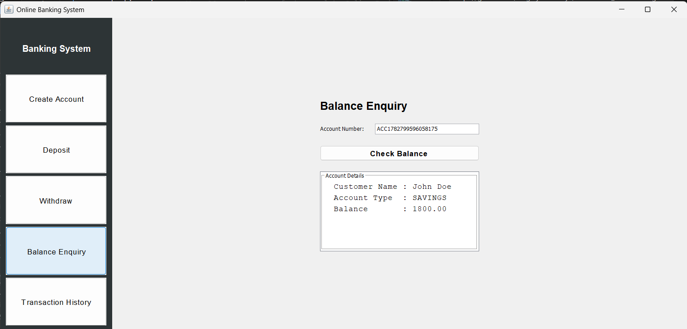
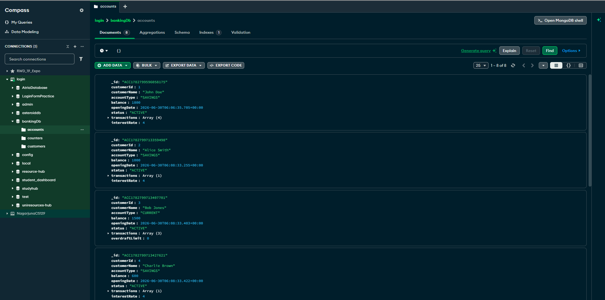
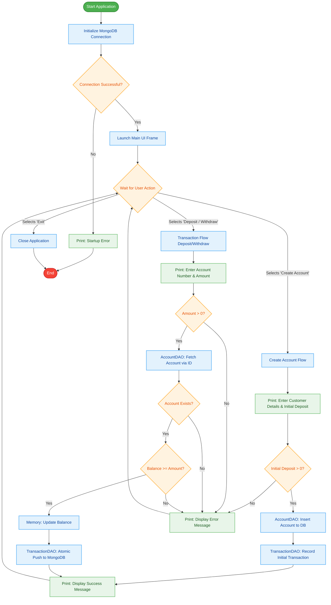

# Online Banking System

A robust, desktop-based banking application built with **Java Swing** and **MongoDB**. This project was developed as part of a time-boxed college hackathon to demonstrate core Object-Oriented Programming (OOP) principles and database integration.

## Features

- **Account Management**: Create new `SAVINGS` or `CURRENT` accounts with distinct business rules.
- **Transactions**: Process deposits and withdrawals with atomic MongoDB updates.
- **Business Logic**: Enforces minimum balance requirements using polymorphism (e.g., Savings accounts require a 500 minimum balance).
- **Ledger**: View a completely ordered, immutable transaction history.
- **Cross-Platform UI**: A clean, responsive desktop interface built with Java Swing CardLayouts.

## Screenshots

### 1. Account Creation


### 2. Balance Enquiry


### 3. Transaction History


### 4. Database Backend (MongoDB)


## Technology Stack

- **Language**: Java 17
- **GUI Framework**: Java Swing / AWT
- **Database**: MongoDB (Localhost:27017)
- **Database Driver**: MongoDB Java Driver Sync 5.1.1
- **Architecture**: Layered MVC (Model, DAO, Service, UI)

## Object-Oriented Principles Demonstrated

- **Encapsulation**: Private fields with public getters/setters in models (`Customer`, `Account`).
- **Abstraction**: Abstract `Account` class with abstract `getMinimumBalance()` method.
- **Polymorphism**: `SavingsAccount` and `CurrentAccount` overriding `getMinimumBalance()` to enforce different withdrawal rules.
- **Exception Handling**: Custom checked exceptions (`InsufficientBalanceException`, `InvalidAmountException`, `AccountNotFoundException`).

## How to Run

1. **Start MongoDB**: Ensure your local MongoDB server is running on `localhost:27017`.
2. **Compile the Code**: 
   Since all dependencies (`bson`, `mongodb-driver-core`, `mongodb-driver-sync`) are included in the `lib/` folder, you can easily compile using `javac` or the provided batch script if on Windows.
3. **Run**: Execute `com.banking.Main`.

```bash
# Example manual compilation (Windows)
javac -d out -cp "lib/*" src/com/banking/**/*.java
java -cp "out;lib/*" com.banking.Main
```

## Application Architecture

```mermaid
classDiagram
    %% Domain Models
    class Customer {
        -String customerId
        -String name
        -String phone
        -String email
        -String address
        +getId() String
        +getName() String
    }

    class Account {
        <<abstract>>
        -String accountNumber
        -String customerId
        -double balance
        -Date openDate
        -String status
        +deposit(double amount) void
        +withdraw(double amount) void
        +getMinimumBalance() double*
        +getBalance() double
    }

    class SavingsAccount {
        -double interestRate
        +getMinimumBalance() double
    }

    class CurrentAccount {
        -double overdraftLimit
        +getMinimumBalance() double
    }

    class Transaction {
        -String transactionId
        -String accountNumber
        -String type
        -double amount
        -double balanceAfter
        -Date txnTime
    }

    %% Service Layer
    class BankService {
        <<interface>>
        +createAccount(Customer c, String type, double amt) String
        +deposit(String acc, double amt) void
        +withdraw(String acc, double amt) void
        +getBalance(String acc) Map
        +getTransactionHistory(String acc) List
        +transfer(String from, String to, double amt) void
    }

    class BankServiceImpl {
        -AccountDAO accountDAO
        -TransactionDAO transactionDAO
    }

    %% DAO Layer (Data Access)
    class AccountDAO {
        <<interface>>
        +createAccount(Customer c, Account a) String
        +getAccountByNumber(String accNum) Account
        +getCustomerName(String accNum) String
    }

    class AccountDAOImpl {
        -MongoDatabase database
    }

    class TransactionDAO {
        <<interface>>
        +recordTransaction(Transaction txn) void
        +getTransactionHistory(String accNum) List
    }

    class TransactionDAOImpl {
        -MongoDatabase database
    }

    class DBConnection {
        -MongoClient mongoClient
        -MongoDatabase database
        +getDatabase() MongoDatabase$
        +close() void$
    }

    %% Inheritance
    SavingsAccount --|> Account
    CurrentAccount --|> Account
    
    %% Service & DAO Implementation
    BankServiceImpl ..|> BankService
    AccountDAOImpl ..|> AccountDAO
    TransactionDAOImpl ..|> TransactionDAO
    
    %% Dependencies
    BankServiceImpl --> AccountDAO
    BankServiceImpl --> TransactionDAO
    AccountDAOImpl --> DBConnection
    TransactionDAOImpl --> DBConnection
```


## Application Flowchart

