# Project Architecture

Here is the detailed Mermaid class diagram representing the Online Banking System. It includes all major properties and methods for the core classes to demonstrate the Object-Oriented design.

```mermaid
classDiagram
    %% ==========================================
    %% Models (Domain Layer)
    %% ==========================================
    class Customer {
        -String customerId
        -String name
        -String phone
        -String email
        -String address
        +getId() String
        +getName() String
    }

    class Account {
        <<abstract>>
        -String accountNumber
        -String customerId
        -double balance
        -Date openDate
        -String status
        +deposit(double amount) void
        +withdraw(double amount) void
        +getMinimumBalance() double*
        +getBalance() double
    }

    class SavingsAccount {
        -double interestRate
        +getMinimumBalance() double
    }

    class CurrentAccount {
        -double overdraftLimit
        +getMinimumBalance() double
    }

    class Transaction {
        -String transactionId
        -String accountNumber
        -String type
        -double amount
        -double balanceAfter
        -Date txnTime
    }

    %% ==========================================
    %% Service Layer
    %% ==========================================
    class BankService {
        <<interface>>
        +createAccount(Customer c, String type, double amt) String
        +deposit(String acc, double amt) void
        +withdraw(String acc, double amt) void
        +getBalance(String acc) Map
        +getTransactionHistory(String acc) List
        +transfer(String from, String to, double amt) void
    }

    class BankServiceImpl {
        -AccountDAO accountDAO
        -TransactionDAO transactionDAO
    }

    %% ==========================================
    %% DAO Layer (Data Access)
    %% ==========================================
    class AccountDAO {
        <<interface>>
        +createAccount(Customer c, Account a) String
        +getAccountByNumber(String accNum) Account
        +getCustomerName(String accNum) String
    }

    class AccountDAOImpl {
        -MongoDatabase database
        -MongoCollection accountsCollection
        -MongoCollection customersCollection
    }

    class TransactionDAO {
        <<interface>>
        +recordTransaction(Transaction txn) void
        +getTransactionHistory(String accNum) List
    }

    class TransactionDAOImpl {
        -MongoDatabase database
        -MongoCollection transactionsCollection
    }

    class DBConnection {
        -MongoClient mongoClient
        -MongoDatabase database
        +getDatabase() MongoDatabase$
        +close() void$
    }

    %% ==========================================
    %% Exceptions
    %% ==========================================
    class AccountNotFoundException
    class InsufficientBalanceException
    class InvalidAmountException

    %% ==========================================
    %% UI Layer (Simplified)
    %% ==========================================
    class MainFrame {
        -BankService bankService
        -JPanel cardPanel
        -CardLayout cardLayout
    }
    class CreateAccountPanel
    class DepositPanel
    class WithdrawPanel
    class BalanceEnquiryPanel
    class TransactionHistoryPanel

    %% ==========================================
    %% Relationships
    %% ==========================================
    
    %% Inheritance
    SavingsAccount --|> Account
    CurrentAccount --|> Account
    
    %% Service & DAO Implementation
    BankServiceImpl ..|> BankService
    AccountDAOImpl ..|> AccountDAO
    TransactionDAOImpl ..|> TransactionDAO
    
    %% Composition / Aggregation (Dependencies)
    BankServiceImpl --> AccountDAO
    BankServiceImpl --> TransactionDAO
    
    AccountDAOImpl --> DBConnection
    TransactionDAOImpl --> DBConnection
    
    BankServiceImpl --> Account
    BankServiceImpl --> Customer
    BankServiceImpl --> Transaction
    
    %% UI Dependencies
    MainFrame *-- CreateAccountPanel
    MainFrame *-- DepositPanel
    MainFrame *-- WithdrawPanel
    MainFrame *-- BalanceEnquiryPanel
    MainFrame *-- TransactionHistoryPanel
    
    CreateAccountPanel --> BankService
    DepositPanel --> BankService
    WithdrawPanel --> BankService
    BalanceEnquiryPanel --> BankService
    TransactionHistoryPanel --> BankService
```

