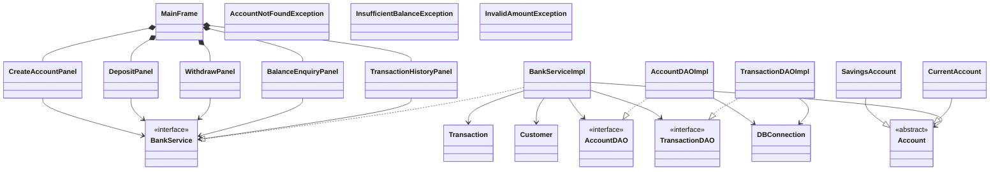

# Project Architecture

Here is the Mermaid code representing the high-level architecture and class relationships of the Online Banking System (headings only).

```mermaid
classDiagram
    %% UI Layer
    class MainFrame
    class CreateAccountPanel
    class DepositPanel
    class WithdrawPanel
    class BalanceEnquiryPanel
    class TransactionHistoryPanel
    
    %% Service Layer
    class BankService {
        <<interface>>
    }
    class BankServiceImpl
    
    %% DAO Layer
    class AccountDAO {
        <<interface>>
    }
    class AccountDAOImpl
    class TransactionDAO {
        <<interface>>
    }
    class TransactionDAOImpl
    class DBConnection
    
    %% Domain Models
    class Account {
        <<abstract>>
    }
    class SavingsAccount
    class CurrentAccount
    class Customer
    class Transaction
    
    %% Custom Exceptions
    class AccountNotFoundException
    class InsufficientBalanceException
    class InvalidAmountException

    %% Relationships (Dependencies)
    MainFrame *-- CreateAccountPanel
    MainFrame *-- DepositPanel
    MainFrame *-- WithdrawPanel
    MainFrame *-- BalanceEnquiryPanel
    MainFrame *-- TransactionHistoryPanel

    CreateAccountPanel --> BankService
    DepositPanel --> BankService
    WithdrawPanel --> BankService
    BalanceEnquiryPanel --> BankService
    TransactionHistoryPanel --> BankService

    BankServiceImpl ..|> BankService
    BankServiceImpl --> AccountDAO
    BankServiceImpl --> TransactionDAO

    AccountDAOImpl ..|> AccountDAO
    TransactionDAOImpl ..|> TransactionDAO
    
    AccountDAOImpl --> DBConnection
    TransactionDAOImpl --> DBConnection

    SavingsAccount --|> Account
    CurrentAccount --|> Account
    
    BankServiceImpl --> Account
    BankServiceImpl --> Customer
    BankServiceImpl --> Transaction
```
