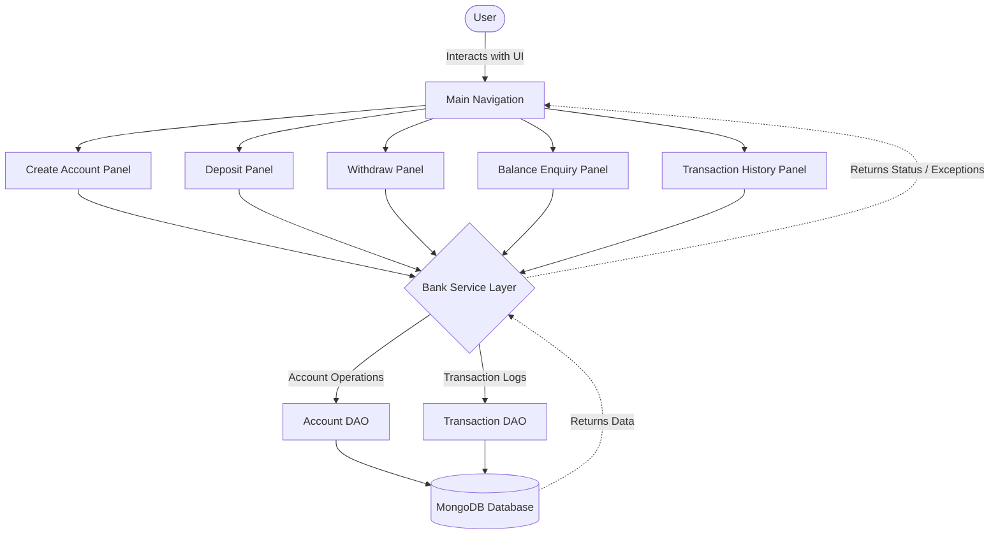

# System Flowchart

Here is the Mermaid flowchart representing the high-level data flow and application execution path (headings only).

```mermaid
flowchart TD
    %% User Interaction
    User([User]) -->|Interacts with UI| MainFrame[Main Navigation]
    
    %% UI Navigation
    MainFrame --> CreateAcc[Create Account Panel]
    MainFrame --> Deposit[Deposit Panel]
    MainFrame --> Withdraw[Withdraw Panel]
    MainFrame --> Balance[Balance Enquiry Panel]
    MainFrame --> History[Transaction History Panel]
    
    %% Service Layer Delegation
    CreateAcc --> BankService{Bank Service Layer}
    Deposit --> BankService
    Withdraw --> BankService
    Balance --> BankService
    History --> BankService
    
    %% Database Access Layer
    BankService -->|Account Operations| AccountDAO[Account DAO]
    BankService -->|Transaction Logs| TransactionDAO[Transaction DAO]
    
    %% Database Target
    AccountDAO --> MongoDB[(MongoDB Database)]
    TransactionDAO --> MongoDB
    
    %% Return Path
    MongoDB -.->|Returns Data| BankService
    BankService -.->|Returns Status / Exceptions| MainFrame
```
