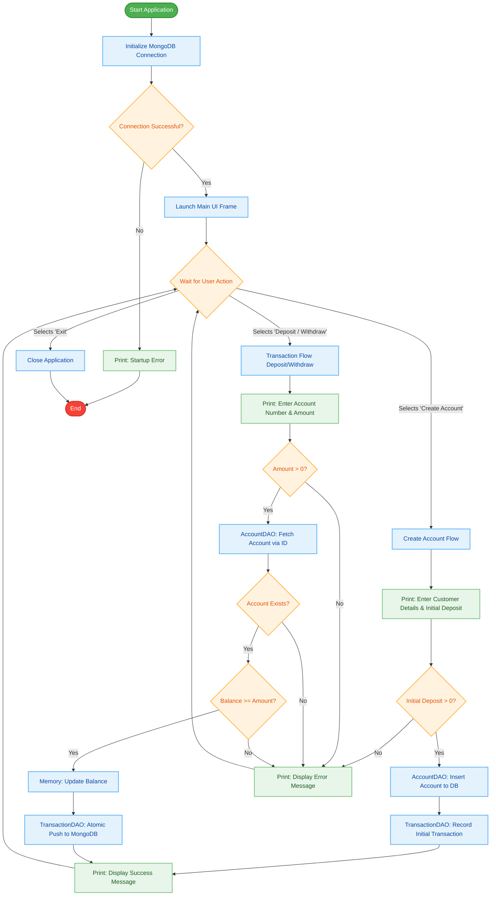

# Detailed Algorithmic Flowchart

Here is the detailed logical flowchart representing the execution algorithm of the Online Banking System, styled perfectly to match your requested theme (Green for Start/I-O, Blue for Processes, Orange for Decisions, and Red for End).

